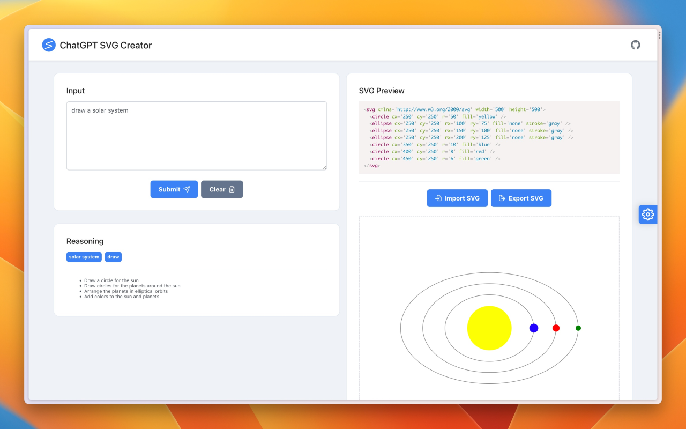

  
  <h3 align="center">ChatGPT SVG Creator</h3>
  

    A browser extension for creating, modifying, and previewing SVGs using ChatGPT
  

  

    English | <a href="./README_CN.md">中文</a>
  

  
Table of Contents

  <ul>
    <li><a href="#install">Install</a></li>
    <li><a href="#overview">Overview</a></li>
    <li><a href="#main-features">Main Features</a></li>
    <li><a href="#demo">Demo</a></li>
    <li><a href="#manual-installation">Manual Installation</a></li>
    <li><a href="#web">Web</li>
    <li><a href="#acknowledgements">Acknowledgements</a></li>
  </ul>

## Install

[![Chrome][Chrome-image]][Chrome-url]

## Overview

With the ChatGPT SVG Creator extension, you can design and modify SVGs using natural language, offering basic previewing, importing, and exporting capabilities.

[CHANGELOG](./CHANGELOG.md) 

#### How to use

1. Configure OpenAI-related parameters in `Settings` before using.
2. Import an existing SVG or start from scratch.
3. For each subsequent conversation round, GPT will append the SVG previewed on the right as a prompt.
4. Export your work.

## Main Features

* Design and modify SVGs using natural language
* Basic SVG preview functionality
* Supports importing and exporting SVG source code and files

## Demo

## Manual Installation

* Download the `chatgpt-svg-creator.zip` file: [Releases](https://github.com/xieziyu/chatgpt-svg-creator/releases)
* Extract the file
* Open Chrome browser's management page: `chrome://extensions`
* Enable Developer Mode
* Load the extracted extension directory

## Web

[ChatGPT SVG Creator](https://github.com/xieziyu/chatgpt-svg-creator-web)

## Acknowledgements

* Thanks to the [ChatHub](https://github.com/chathub-dev/chathub) project for inspiring me in terms of extension page management

[Chrome-image]: https://img.shields.io/badge/-Chrome-brightgreen?logo=google-chrome&logoColor=white

[Chrome-url]: https://chrome.google.com/webstore/detail/chatgpt-svg-creator/kgcmhfioeibcfbcchmmhagngnodaepcj?utm_source=website