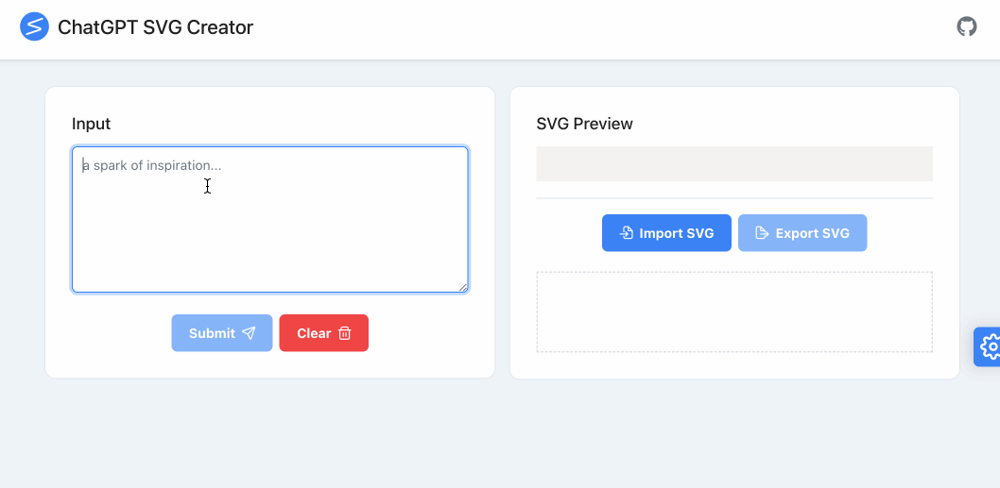
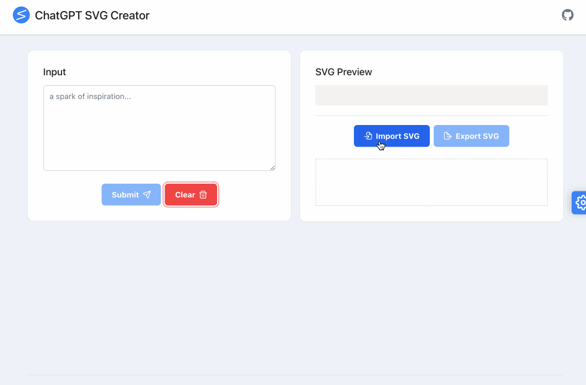

  
  <h3 align="center">ChatGPT SVG Creator</h3>
  

    借助 ChatGPT 来创建、修改和预览 SVG 的浏览器扩展
  

  

    <a href="./README.md">English</a> | 中文
  

  
目录

  <ul>
    <li><a href="#安装">安装</a></li>
    <li><a href="#概述">概述</a></li>
    <li><a href="#主要功能">主要功能</a></li>
    <li><a href="#演示">演示</a></li>
    <li><a href="#手动安装">手动安装</a></li>
    <li><a href="#致谢">致谢</a></li>
  </ul>

## 安装

[![Chrome][Chrome-image]][Chrome-url]

## 概述

借助 ChatGPT SVG Creator 扩展，我们可以使用自然语言来设计和修改 SVG，提供了基础的预览以及导入、导出功能。

**使用方法**

1. 使用前请先在 `Settings` 中配置 OpenAI 相关的参数。
2. 导入已有的 SVG 或者从 0 开始创建。
3. 之后进行的每轮对话，GPT 都会附加右侧预览中的 SVG 作为提示。
4. 导出你的作品

## 主要功能

* 使用自然语言来设计和修改 SVG
* 基础的 SVG 预览功能
* 支持导入和导出 SVG 源码和文件

## 演示

#### 创建一个新的 SVG 并修改

#### 导入已有的 SVG 并修改

## 手动安装

* 下载 `chatgpt-svg-creator.zip` 文件: [Releases](https://github.com/xieziyu/chatgpt-svg-creator/releases)
* 解压文件
* 打开 Chrome 浏览器的管理页面: `chrome://extensions`
* 开启开发者模式
* 加载解压后的扩展目录

## 致谢

* 感谢 [ChatHub](https://github.com/chathub-dev/chathub) 项目在插件页面管理上给予我的启发

[Chrome-image]: https://img.shields.io/badge/-Chrome-brightgreen?logo=google-chrome&logoColor=white

[Chrome-url]: https://chrome.google.com/webstore/detail/chatgpt-svg-creator/kgcmhfioeibcfbcchmmhagngnodaepcj?utm_source=website